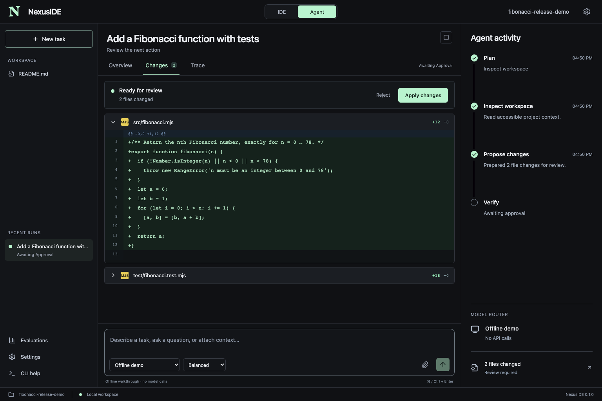

# NexusIDE

A local-first AI coding workspace with a standalone desktop app, a VS Code extension, a browser dashboard, and a CLI for PowerShell, macOS, and Linux. Use IDE mode for focused help or Agent mode to plan, inspect files, propose edits, review changes, and verify the result.



**Version 0.3.0** adds a standalone Electron desktop app alongside the VS Code extension and CLI. Bring your own provider credentials, or try the offline walkthrough without API calls. Files and agent execution remain local; selected cloud models receive your prompt and requested project context.

## Download and start

Open [GitHub Releases](https://github.com/Yash789k/nexuside/releases/latest) and choose a download for your operating system.

### Standalone desktop app

- **macOS Apple Silicon:** `NexusIDE-0.3.0-mac-arm64.dmg` — open it and drag NexusIDE to Applications.
- **Windows x64:** `NexusIDE-0.3.0-win-x64.exe` — run the per-user installer.
- **Linux x64:** `NexusIDE-0.3.0-linux-x64.AppImage` or `.deb` — use the portable app or Debian package.

Launch **NexusIDE**, select **Open project folder**, then configure a provider in **Settings**. The app includes its UI and Node runtime: VS Code, a separate Node installation, a terminal server and Docker are not required to launch it. **Try an offline walkthrough** creates a separate project; in Agent mode, choose **Try the offline walkthrough**, review the edits, then approve the bundled Node tests.

Desktop builds are currently unsigned/not notarized for public distribution. macOS and Windows may require their normal first-launch approval. See [desktop installation and limitations](docs/desktop.md). A ZIP contains the macOS app as an alternative to the DMG. Availability and platform test results are recorded in each release's notes.

### VS Code

1. Download `nexuside-0.3.0.vsix`.
2. In VS Code, open **Extensions → … → Install from VSIX** and select it.
3. Open and trust a project folder.
4. Run **NexusIDE: Open Workspace** from the command palette.
5. Select **Try the offline walkthrough**, or open **Settings** to connect your models.

You can also install with `code --install-extension ./nexuside-0.3.0.vsix`. The extension bundles its runtime; you do not need to run npm install in your project.

### Terminal / PowerShell

Install [Node.js 22 or later](https://nodejs.org/en/download), download `nexuside-0.3.0.tgz`, then run:

```sh
npm install -g ./nexuside-0.3.0.tgz
nexus --help
nexus demo --yes
```

PowerShell accepts the same commands. If your machine blocks the `npm.ps1` or `nexus.ps1` shim, use `npm.cmd` and `nexus.cmd` with the same arguments. No execution-policy change is needed.

The default demo uses Docker for its tests. Without Docker, explicitly run the known demo code locally:

```sh
nexus demo my-demo --yes --host
```

Open any project in the dashboard:

```sh
nexus -w ./my-project serve
```

Or work directly from the terminal:

```sh
nexus -w ./my-project run "Add input validation and tests"
nexus -w ./my-project chat
nexus -w ./my-project runs
nexus -w ./my-project approve <run-id> --revision <pending-revision>
nexus -w ./my-project approve <run-id> --revision <pending-revision> --reject
nexus -w ./my-project resume <run-id>
nexus -w ./my-project trace <run-id> --verify
nexus -w ./my-project eval --json
```

Approvals pause and persist. `--yes` auto-approves file changes and Docker tests. Host tests additionally require `--allow-host-tests`. Commits and browser actions still need explicit review. `--json` produces machine-readable run state and pauses for approval; scripts can continue using `approve --revision <pending.revision>`. Each approval is bound to the displayed action, contents, and configuration. Old approvals cannot authorize a later action.

The earlier release's [recorded walkthrough](https://github.com/Yash789k/nexuside/releases/download/v0.1.0/nexuside-0.1.0-demo.webm) shows its review, test, trace, and evaluation flow.

## What works

| Capability | Implementation |
|---|---|
| IDE and Agent modes | Shared engine, chat, plans, focused edits, manual inline completion in VS Code |
| Routing | Task classification, capability filtering, economy/balanced/quality preferences, configurable token rates, history-informed rankings, temporary-error fallback |
| Providers | OpenAI Chat Completions, Anthropic Messages, native Gemini, OpenRouter, OpenAI-compatible Ollama |
| Workspace tools | List, read, literal search, full-file proposals, diff review, conflict detection, editor/save |
| Terminal | Approved fixed test targets: `node --test`, `npm test`, `python -m pytest -q`; no free-form shell |
| Git | Status and diff; explicit approval to commit files changed by the run |
| Browser | Disposable Playwright container, click/fill/scroll/wait, DOM text, screenshots for actions, public-domain allowlist |
| Multimodal | Image attachments for capable providers; audio/video file attachments for Gemini and compatible OpenRouter models; up to 5 files / 20 MB |
| Traces and evaluation | Local JSONL hash chains, run history, token/cost/latency accounting, deterministic checks, JSONL export |
| Distribution | Self-contained CLI tarball, VSIX, source archive, repeatable GitHub Actions releases |

The offline provider is **a deterministic Fibonacci fixture**, not a language model. It supports the installation walkthrough only; unsupported requests fail clearly. The demo writes an iterative function with input validation and runs three actual Node tests.

## Configure providers

In the dashboard, open **Settings**. Enable the models you want and save a provider credential. Desktop keys use session memory by default. Explicitly enable **Remember provider keys on this device** before saving keys to encrypt them in the system credential store; this may request OS permission. In VS Code, keys use `SecretStorage`; the **NexusIDE: Configure Provider Key** command also stores them there. Browser dashboard keys are held in server memory for that session and are never written into project files.

The standalone CLI can use existing environment variables `OPENAI_API_KEY`, `ANTHROPIC_API_KEY`, `GEMINI_API_KEY`, and `OPENROUTER_API_KEY`. It does not read `.env` files automatically. To use local Ollama, enable it in Settings, run your Ollama server, and set a tool-capable model ID that you have installed. Cloud calls send the requested prompt and tool-read context to your selected provider.

Model IDs, endpoints, intelligence tiers, and USD prices per million tokens are editable. The PDF's model names are not treated as guaranteed API IDs. Defaults are starting examples; availability depends on the provider account. Prices and budget guards are estimates, not authoritative billing limits. Router confidence is a heuristic, not a measured accuracy claim.

CLI/dashboard configuration lives at `~/.config/nexuside/config.json` on all platforms unless `NEXUS_CONFIG` points elsewhere. Desktop configuration is separate, in the OS application-data folder listed in [desktop data and recovery](docs/desktop.md#data-and-recovery). Use `nexus config --path`, `nexus config --init`, and `nexus models` to inspect CLI setup. Existing runs retain their configuration snapshot so an approval cannot silently switch execution policy.

## OpenRouter

OpenRouter is a first-class provider in the shared VS Code, dashboard, and CLI agent framework. Add `OPENROUTER_API_KEY` in Settings or your terminal environment. Three presets cover inexpensive coding (`openrouter-coder`), complex refactors (`openrouter-quality`), and media analysis (`openrouter-multimodal`).

```sh
nexus run "Explain this project" --model openrouter-coder
nexus run "Review this bug recording" --model openrouter-multimodal --attach bug.mp4
nexus openrouter catalog --search coder
nexus openrouter catalog --modality video --json
nexus openrouter add deepseek/deepseek-chat-v3-0324 --tier 2 --sort price
```

The last command is an example: use an ID returned by the current catalog. **Settings → OpenRouter model catalog** provides the same discovery/import workflow. Only tool-capable text-output models with known nonnegative token rates are importable. Catalog access needs no key; inference uses your account.

Expand any OpenRouter model to set price/latency/throughput sorting, provider order/allowlist/exclusions, provider fallbacks, up to four alternate models, performance targets, data-collection policy, zero data retention, and optional reasoning effort. Input/output token prices also act as OpenRouter provider price ceilings, including alternate models. These ceilings can exclude endpoints; update them when prices change. Model defaults and prices were checked against the live catalog during release preparation.

OpenRouter-reported cost, actual model, and provider (when returned) are recorded in the trace; otherwise cost uses configured estimates. Reasoning state is preserved across tool turns for the same model. See [OpenRouter use cases and configuration](docs/openrouter.md) for examples and boundaries.

## VS Code shortcuts

- **NexusIDE: Open Workspace** — full workspace and review dashboard.
- **NexusIDE: Suggest Inline Completion** — `Cmd+Alt+Space` / `Ctrl+Alt+Space`; accept the suggestion with VS Code's normal inline-completion controls.
- **NexusIDE: Edit Selection** — describe a change and review the proposed file edits.
- **NexusIDE: Configure Provider Key** — protected credential storage.

Inline completion is explicitly invoked; background keystroke-triggered billing is disabled. The first workspace folder is used in multi-root windows. Untrusted workspaces cannot use the extension.

## Isolated execution

Install and start [Docker Desktop](https://www.docker.com/products/docker-desktop/). Node test snapshots use the `node:22-alpine` image. Build the Playwright/pytest image once:

```sh
nexus sandbox-build
```

The browser has a fresh profile and no host workspace mount, Docker socket, provider keys, or desktop credentials. It is placed on an internal Docker network; only its proxy has egress. The proxy accepts exact allowlisted HTTPS hosts on port 443, resolves and pins public IPv4 addresses, and rejects private destinations. Add each required asset/navigation domain in Settings. Password fields are blocked. Use test sites and synthetic data.

Docker tests receive a text-file snapshot with secrets, symbolic links, generated folders, and `node_modules` excluded. The test network is disabled. Dependency-heavy npm projects need a prepared test environment, or the explicit **This computer** setting for trusted project code. Docker pytest includes pytest but not your application's third-party dependencies. Host mode is an approval gate, not an OS sandbox.

## Data and limits

State is stored under the workspace's `.nexus/` directory, which contains its own ignore-all `.gitignore`. Run files include context, proposed code, and test results. Traces redact common key/token patterns, but may contain private source and task text; review exports before sharing. Keys are never stored in run configuration. File access blocks traversal, secret paths, symbolic links and hard links; proposals reject stale preimages before applying any file.

Hash chains detect ordinary log edits; they are **not immutable or cryptographically anchored against an attacker with access to your account**. Evaluation scores summarize deterministic checks; they do not establish semantic correctness. A run is marked verified only after a successful test command and an intact trace. Tests may still be incomplete.

This release automates browser pages, not arbitrary operating-system desktops. Voice/video are uploaded-file workflows, not live calls or continuous screen capture. It does not include cloud workers, VM-level isolation, a learned router, an LLM judge, marketplace publishing, or performance claims from the concept document. API integrations are contract-tested with local HTTP fixtures; paid live calls require your configured credentials.

## Development

```sh
npm ci
npm run check
npm run dev
```

Additional validation:

```sh
npx playwright install chromium
npm run test:e2e
npm run test:extension
npm run sandbox-build
```

For sandbox checks:

```sh
docker build -t nexuside-sandbox:0.1.0 sandbox
npm run test:sandbox
```

`npm run test:extension` uses a clean VS Code profile and exercises activation, native document save, actual webview editing, host zoom and panel lifecycle; unavailable foreground checks are explicitly reported. Set `NEXUS_VSIX` to test an installed local VSIX. On Linux, use `xvfb-run -a npm run test:extension`. CI is configured for Windows, macOS and Linux; a configuration is not evidence that this local change has run on those hosts. See [OpenRouter](docs/openrouter.md), [architecture](docs/architecture.md), [validation](docs/validation.md), [contributing](CONTRIBUTING.md), and [release notes](CHANGELOG.md).

```sh
npm run release:local
```

The release workflow builds, tests, packages and uploads VSIX, npm tarball and checksums for a `v*` tag. GitHub hosts source and downloadable packages; workspace processing runs locally.

## License

MIT. See [LICENSE](LICENSE).


## IDE workspace and QA build

IDE mode has CodeMirror tabs, up to four resizable editor groups, shared document views, tab reordering and edge drops, quick-open, literal workspace search, file/folder creation, rename, recoverable deletion, Save/Save All, optional idle autosave, and contextual file assistance. Agent mode retains task drafts, history, approvals, changes, traces and evaluations. Switching the visible mode never changes a saved run's mode or configuration. IDE requests cannot invoke test, browser or commit execution tools.

Use Commands for find/replace, go-to-line, split, move/close group, undo/redo and word wrap. Cmd/Ctrl+P opens files; Cmd/Ctrl+Shift+P opens commands; Cmd/Ctrl+S saves; add Shift for Save All; Cmd/Ctrl+\ splits right; add Shift for below; Ctrl+PageUp/PageDown switches tabs; Cmd/Ctrl+Alt+Left/Right focuses groups. Native browser/VS Code zoom shortcuts remain owned by the host.

Dirty documents survive tab/mode changes. Last-view close offers Save/Discard/Cancel. Reload restores content and layout from `.nexus/editor-sessions`; watch the recovery status before closing. Undo history restarts after reload. Browser close prompts protect dirty buffers, and backend recovery errors remain visible. No application can guarantee the last keystroke survives power loss before persistence. External changes reload clean buffers; dirty buffers require explicit comparison. A stale save cannot overwrite a newer file. Multi-file writes use a recovery journal; conflicting external edits preserve that journal for manual recovery.

Supported bounds: 512,000 bytes per UTF-8 text file; 100 open documents; four groups; 1,200 indexed entries/12 levels; 100 content-search hits; five media attachments/20 MB total; 24 MB per editor recovery snapshot. Truncation is disclosed. Quick Open accepts exact paths beyond the index. Deleted items remain under `.nexus/trash` until you remove them; they are excluded from agent file tools. No browser LSP, debugger or unrestricted terminal is advertised; those are VS Code host capabilities.

Run `npm run test:smoke`, `npm run test:e2e`, `npm run test:cli`, `npm run test:extension`, `npm run test:stress`, and `npm run test:soak`. The soak defaults to **1,800 real seconds** with seed 230923 and local provider fixtures. `npm run test:performance` compares the baseline sibling checkout and this checkout on identical generated workloads. See [QA commands and limitations](docs/qa/README.md), [coverage contract](docs/qa/contract.md), and the interaction matrix in that directory. Local packaging writes into `../nexuside-local-qa`; it does not publish or modify GitHub releases.
